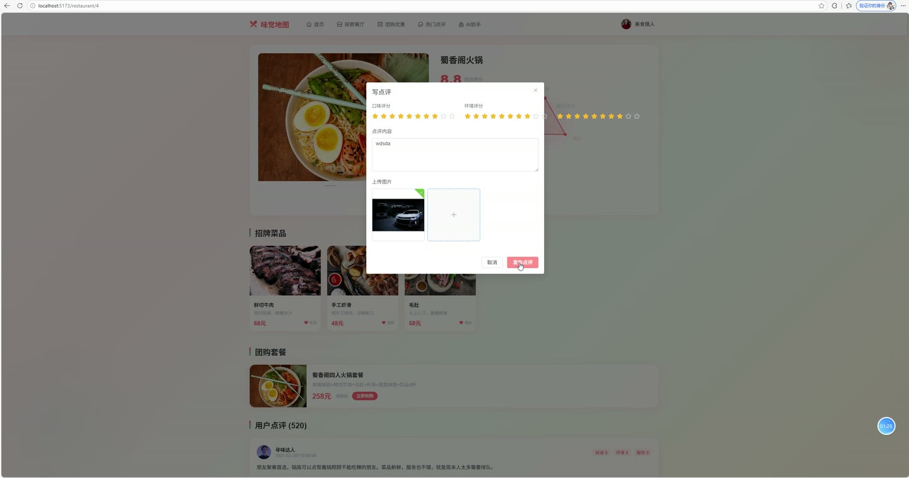
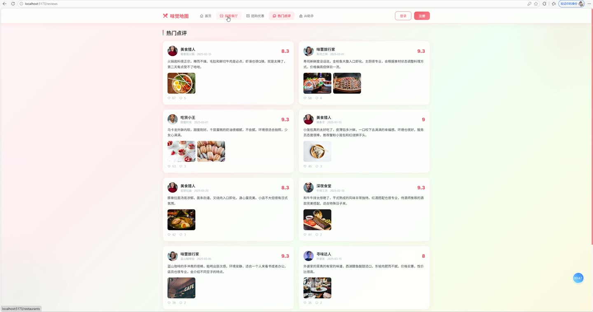
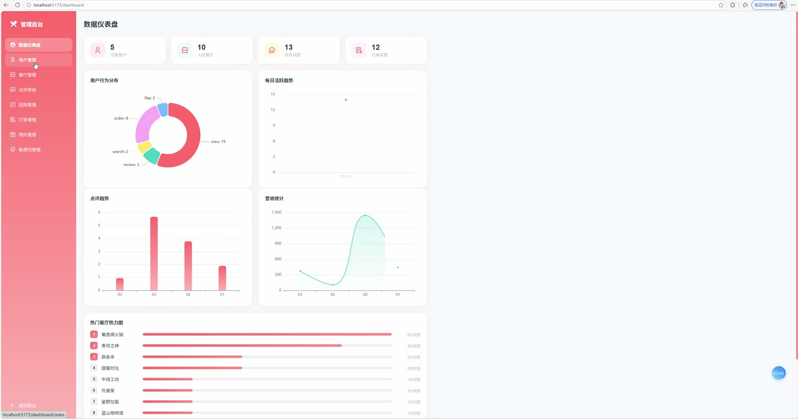
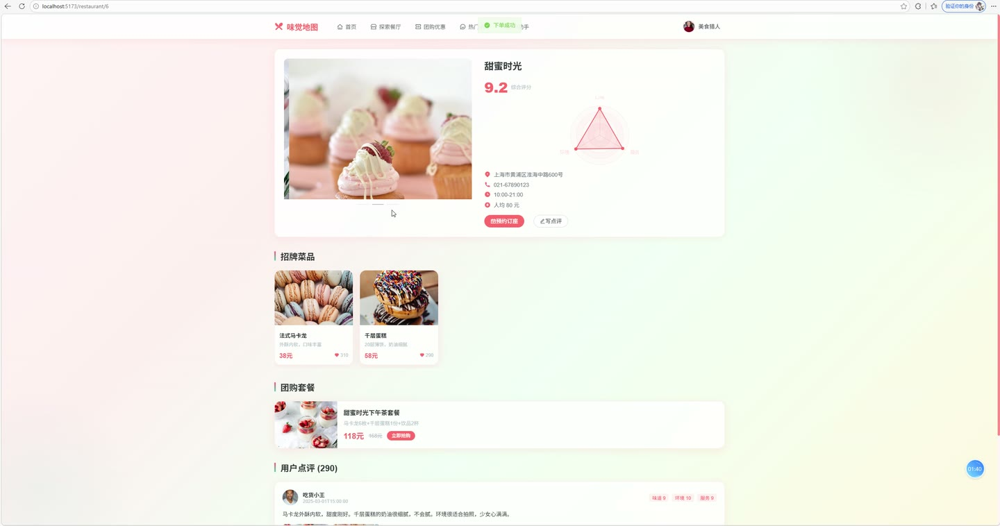

# (附文档)Springboot2+Vue3+MySQL 美食点评社区

**技术栈**：Springboot2、Vue3、MySQL

### 系统简介

味觉地图美食点评社区是一套前后端分离的餐饮点评与团购预订系统，包含普通用户端与管理员端两大角色。系统涵盖餐厅浏览与检索、多维评分点评、团购下单、在线预约、AI 美食助手、协同过滤推荐等完整业务流程，并配备管理后台用于内容审核与数据统计。
 
### 核心功能
 
### 普通用户端

 
- 注册与登录：支持用户名密码注册，密码经 MD5 加密存储，登录后签发 JWT 令牌用于后续身份认证。 
- 浏览餐厅列表：按分类/关键词分页检索餐厅，展示封面、人均消费、综合评分与点评数量，默认按评分降序排列。 
- 查看餐厅详情：展示餐厅基本信息、菜品列表、在售团购套餐，并记录用户浏览行为用于后续推荐。 
- 发表点评：对餐厅进行口味、环境、服务三维打分（1-5 分），系统自动计算综合均分，提交内容自动进行敏感词检测，命中敏感词则进入待审核状态。 
- 回复与点赞：可对已有点评发表回复（支持嵌套回复），也可对点评进行点赞/取消点赞，点赞数实时更新。 
- 购买团购套餐：选择团购商品并指定数量，下单时自动校验库存并扣减，生成唯一订单号，支持模拟在线支付（更新订单状态）。 
- 查看我的订单：分页展示个人订单列表，包含团购标题、餐厅名称、数量、金额及订单状态（待支付/已支付/已使用/已退款）。 
- 创建餐厅预约：填写预约日期、时段、用餐人数、联系人及电话，提交后进入待确认状态，可查看预约处理进度。 
- AI 美食助手：集成大模型对话接口，用户可提问获取餐厅/美食推荐，对话记录自动保存，可查看最近 20 条历史问答。 
- 个性化推荐：根据用户历史浏览行为，基于协同过滤算法推荐相似用户喜欢的餐厅；无行为数据时默认返回高分餐厅。 
- 个人资料管理：查看与修改个人昵称、头像、邮箱、手机号等基本信息。 
- 浏览热门点评：查看全站点赞数最高的 10 条点评内容。
 
### 管理员端

 
- 数据看板：统计用户数、餐厅数、点评数、订单数、待审核点评数、待处理预约数，并展示月度点评/营收趋势、用户行为分布、近 30 日活跃度及热门餐厅排行。 
- 用户管理：分页查询用户列表（支持用户名/昵称关键词搜索），可启用或禁用用户账号，被禁用账号无法登录。 
- 餐厅管理：新增、编辑、删除餐厅，维护名称、分类、封面图、地址、电话、人均消费、营业时间及描述信息，支持按关键词搜索。 
- 菜品管理：按餐厅维度维护菜品，包括菜名、图片、价格、描述等字段的增删改操作。 
- 分类管理：新增、编辑、删除餐厅分类，设置分类名称、图标及排序权重。 
- 点评审核：分页查看全站点评（含用户与餐厅信息），对待审核点评执行通过或驳回操作，控制内容展示。 
- 团购管理：发布、编辑、下架团购套餐，设置标题、所属餐厅、原价/团购价、库存、图片及描述，实时展示已售数量。 
- 订单管理：分页查看全站订单流水，包含订单号、团购信息、餐厅、数量、金额、状态及下单时间。 
- 预约管理：查看全部预约记录，对待确认预约执行确认、完成或取消操作，支持按状态筛选。 
- 敏感词管理：维护敏感词库，支持新增与删除敏感词，用于点评发布时的自动内容过滤。
 
### 技术栈

  后端框架 Spring Boot 2.x   ORM 框架 MyBatis-Plus（含分页插件、逻辑删除）   权限认证 JWT（拦截器校验）   前端框架 Vue 3（Composition API）   状态管理 Pinia   UI 组件库 Element Plus   路由 Vue Router 4（含路由守卫）   构建工具 Vite   数据库 MySQL 8.x   HTTP 客户端 OkHttp（AI 接口调用）   工具库 Hutool（MD5 加密）、Fastjson2（JSON 解析） 
 
### 交付内容

 
- 后端完整源码 
- 前端完整源码 
- 数据库初始化脚本 
- 万字文档

## 界面展示

---

## 获取完整源码 + 万字文档

本仓库为项目介绍页。**完整前后端源码、数据库初始化脚本、万字项目文档**，请加微信 `kangkangcode`，或访问 [codekk.top](http://codekk.top) 获取。

可作课程设计 / 毕业设计参考，支持远程部署调试。